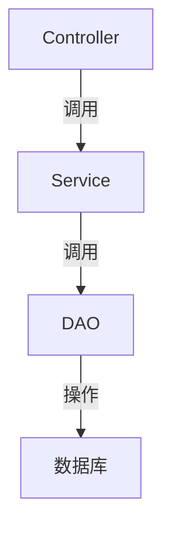

# AI代码理解指南

## 🧠 代码理解方法论

### 1. 分层理解法
- **架构层**：理解整体项目结构和技术栈
- **模块层**：分析功能模块划分和交互关系
- **类层**：研究核心类的职责和接口
- **方法层**：理解具体方法的实现逻辑

### 2. 调用链追踪


### 3. 上下文关联
- 向上追溯：该方法被谁调用？
- 向下深入：该方法调用了哪些其他方法？
- 横向关联：是否有相似功能的其他方法？

## 🔍 核心代码解读

### 1. 控制器层
```php
// 典型控制器方法
public function createOrder() {
    // 1. 参数验证
    $params = $this->request->post();
    $this->validate($params);

    // 2. 调用服务层
    $orderId = $orderService->createOrder($params);

    // 3. 返回结果
    return $this->success(['order_id' => $orderId]);
}
```

### 2. 服务层
```php
// 典型服务方法
public function createOrder($params) {
    // 1. 校验商品
    $this->checkProducts($params['products']);

    // 2. 计算价格
    $amount = $this->calculateAmount($params);

    // 3. 创建订单
    $orderId = $this->orderDao->create([
        'user_id' => $params['user_id'],
        'amount' => $amount,
        'status' => 'unpaid'
    ]);

    // 4. 扣减库存
    $this->productService->deductStock($params['products']);

    return $orderId;
}
```

### 3. DAO层
```php
// 典型DAO方法
public function create($data) {
    $data['create_time'] = time();
    return Db::name('order')->insertGetId($data);
}
```

## 📚 代码学习路径

### 1. 入门路径
1. 从控制器入口理解业务流
2. 跟踪核心业务的服务层实现
3. 了解基础数据访问操作

### 2. 进阶路径
1. 研究异常处理机制
2. 分析中间件实现
3. 理解事件和监听机制

### 3. 高级路径
1. 研究性能优化点
2. 分析安全防护措施
3. 理解扩展机制

## 💡 理解技巧

### 1. 调试技巧
```php
// 使用日志输出关键变量
Log::info('Order create params: ' . json_encode($params));

// 使用断点调试
xdebug_break();
```

### 2. 可视化工具
- 使用UML工具绘制类图
- 使用时序图描述调用流程
- 使用思维导图整理功能模块

### 3. 文档辅助
- 结合接口文档理解参数
- 参考数据库字典理解数据结构
- 查看测试用例了解预期行为

## 🛠️ 常见问题解决

### 1. 如何快速定位业务逻辑？
- 搜索相关关键词（如方法名、表名）
- 跟踪核心数据表的变化
- 分析日志中的调用链

### 2. 如何理解复杂算法？
- 分解为小步骤逐步验证
- 编写单元测试验证边界条件
- 使用可视化工具展示数据流

### 3. 如何评估代码质量？
- 检查分层是否清晰
- 评估单元测试覆盖率
- 分析代码重复度
- 检查异常处理是否完备

---

> **提示**：该文档由AI生成，仅供参考。
